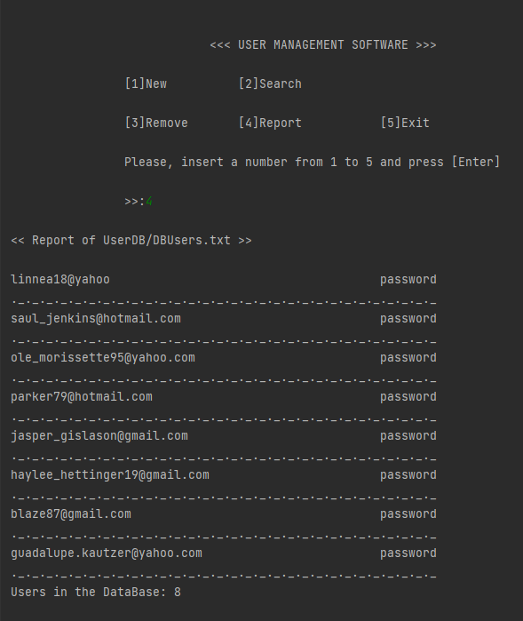

<h1>User Management CRUD </h1>
 

<h2>Hi 👋 My name is GIUSEPPE ALLOCCA</h2>
<h5>IT Technician / IoT Maker / Full-Stack Developer in training at Open Bootcamp</h5>

I developed this software which simulates a small DB and manages users with a complete CRUD system.
  
Future implementations can be a graphical interface and a real database.
  
I am currently a student at OpenBootCamp (starting October 2021)in order to obtain certifications as a Full Stack Developer.

  
* 🌍  I'm based in Spagna
  
* ✉️  You can contact me at [allocca.pino@gmail.com](mailto:allocca.pino@gmail.com)

* 🧠  I'm learning C# and .NET

* 🤝  I'm open to collaborating on Software Projects and Prototypes

* ⚡  http://fab.academany.org/2018/labs/fablabsiena/students/giuseppe-allocca/

<h2> Skills</h2>

### Socials

    

